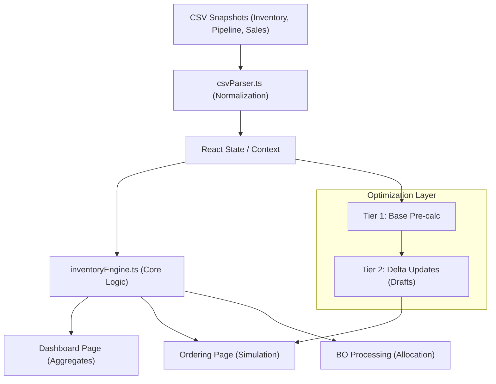

# ATP Supply Chain Application Development Skill (Advanced)

This document is the definitive technical reference for the ATP v12 application. Use it to maintain consistency across the engine, data processing, and premium user interface.

## 1. Project Organization (File Structure)

The app follows a clear separation of concerns between core logic, UI pages, and reusable widgets.

### Folder Breakdown
- **`/pages`**: Main interface workbenches (8 total).
    - `Dashboard.tsx`: High-level KPI overview & Strategic Supply Matrix.
    - `Ordering.tsx`: Supply simulation, suggestion engine, and draft management.
    - `BackorderProcessing.tsx`: BO Radar, allocation logic, and resolution export.
    - `DemandIntelligence.tsx`: AI-driven volatility assessment and risk detection.
    - `SupersessionManagement.tsx`: CRUD for part replacement/mapping history.
    - `Settings.tsx`: Global parameters (Lead Time, Safety Period, Cost Basis).
    - `SkuDetail.tsx`: 12-month historical demand charts & detailed allocation.
    - `FileUpload.tsx`: CSV ingestion layer.
- **`/components`**: 23+ Specialized UI widgets.
    - `SimulationLab.tsx`: Interactive What-If analysis for ROP/SS.
    - `ConsolidatedStockCell.tsx`: Regional stock grouping (NB+BB) vs. BO.
    - `StockProgressBar`: Normalized stock level visualization.
    - `SalesHistoryChart.tsx`: Recharts-based demand trend analysis.
- **`/utils`**: Business logic & data processing.
    - `inventoryEngine.ts`: The "Brain". Single source for all metrics.
    - `csvParser.ts`: Advanced parsing for unpredictable CSV formats.
    - `supersessionGraph.ts`: Graph theory implementation for part chains.
- **`/types`**: Shared TypeScript interfaces (`inventory.ts`).

## 2. System Architecture & Data Flow



## 3. Core Inventory Engine (`inventoryEngine.ts`)

The engine is the **Single Source of Truth**. All calculations must happen here to ensure the Dashboard totals match the Ordering line items.

### A. Demand Resolution Logic
The engine resolves "Monthly Demand" using a 4-tier fallback:
1. **BaseForecast**: Primary source (provided by planning system).
2. **Settings Source**: Uses `AvgQty3M`, `6M`, or `12M` based on user selection.
3. **Historical Average**: If settings sources are 0, averages the last 12 months of `SalesHistory`.
4. **Safety Minimum**: Defaults to `0.01` to prevent division-by-zero errors.

### B. Inventory Thresholds
- **Daily Demand**: `DemandMonthly / 30`.
- **Safety Stock (SS)**: `DailyDemand * SafetyPeriod`.
- **Reorder Point (ROP)**: `DailyDemand * (LeadTime + SafetyPeriod)`.
- **Stock Max**: `ROP + (DailyDemand * ReplenishmentPeriod)`.

### C. Simulation Fields
Real-time simulation in the Ordering page uses `draftQty` (Air + Sea):
```typescript
simulated: {
    totalStock: available + pipeline + draftQty,
    excessQty: Math.max(0, (available + pipeline + draftQty - bo) - stockMax),
    boQty: Math.max(0, bo - (available + pipeline + draftQty))
}
```

## 4. High-Performance Engineering

With datasets exceeding 10,000 SKUs, full re-calculation on every keystroke causes UI lag.

### Two-Tiered Memoization Pattern
Standard pattern used in `Ordering.tsx`:

1. **Base Tier**: Pre-calculates all items with `draftQty = 0`. Only re-runs when the main dataset or settings change.
2. **Delta Tier**: Iterates over the Base Tier. If an item has a draft quantity, it re-runs `computeInventory` for **only that SKU**.

```typescript
// Tier 1: Cache expensive base calculations
const baseList = useMemo(() => computeInventoryBatch(data, params, {}), [data, params]);

// Tier 2: Lightning fast updates for edits
const enrichedList = useMemo(() => {
    return baseList.map(item => {
        const draft = orderQuantities[item.ItemCode];
        if (draft && (draft.air + draft.sea > 0)) {
            // Re-calculate ONLY the modified item
            return { ...item, computed: computeInventory(item, params, draft.air + draft.sea) };
        }
        return item; // Reuse reference from Tier 1
    });
}, [baseList, orderQuantities]);
```

## 5. State Management & Navigation (`App.tsx`)

The app uses a **Centralized Source** pattern for its primary data.
1. **Data Ingestion**: `FileUpload` parses CSVs into a flat `InventoryItem[]`.
2. **Global Context**: `useLanguage()` (i18n) and `DashboardSettings` drive calculations.
3. **Prop Drilling vs. Context**: Core data is passed via props to `pages`, while simple state like `language` is handled via Context.
4. **View Switching**: `App.tsx` manages a `currentView` string state, conditionally rendering the 8 main pages.

## 6. Advanced UI/UX Standards

### A. Color Palette & Aesthetics
- **Core Theme**: Navy-Indigo (`#1e1b4b`, `#0f172a`).
- **Gradients**: Use `bg-gradient-to-br from-blue-900 via-indigo-950 to-slate-950` for premium backgrounds.
- **Zebra Striping**: Required on all data tables for readability (`even:bg-slate-50/50`).

### B. Smart Badges
- **Picking Priority**: `P1 (Critical)` = Red/Rose, `P2 (Watch)` = Amber, `P3 (Healthy)` = Emerald.
- **Combined Layout**: Always use a vertical 2-line layout for Debt Status inside tables to save horizontal space.
  - Line 1: Priority Badge (e.g., "P1")
  - Line 2: Debt Label (e.g., "PO Cover") in small bold uppercase.

### C. Financial Formatting
- **VND (PP Cost)**: `Intl.NumberFormat('vi-VN', { style: 'currency', currency: 'VND', maximumFractionDigits: 0 })`.
- **EUR (FOB Cost)**: `Intl.NumberFormat('en-IE', { style: 'currency', currency: 'EUR', maximumFractionDigits: 2 })`.
- **Empty Logic**: Use a dash (`-`) in a muted color for zero values in tables to reduce visual noise.

## 7. Data Handling & CSV Nuances

### Header Normalization
- **Inventory Tags**: Match headers like `QuantityInventory_NB` and `QuantityDC_NB`.
- **Pipeline Tags**: Map headers starting with `O O.` (e.g., `O O.2503`) to `IncomingPO`.
- **Cost Normalization**: Price fields must be parsed through `parseNum` to handle both `1,234.56` and `1.234,56` locales.

## 8. Development Pitfalls (Gotchas)
- **Imports**: When adding engine calls to new pages, ensure `computeInventory` is imported from `utils/inventoryEngine`. Missing imports cause a "White Screen" crash in production.
- **Zero Suggestion**: Suggestion buttons (e.g., "Suggest: 10") must be hidden if the value is `0` to prevent rendering "Suggest: 0" which confuses users.
- **Identity Check**: Ensure `DashboardSettings` objects passed to the engine are memoized, or they will invalidate Tier 1 caches.
