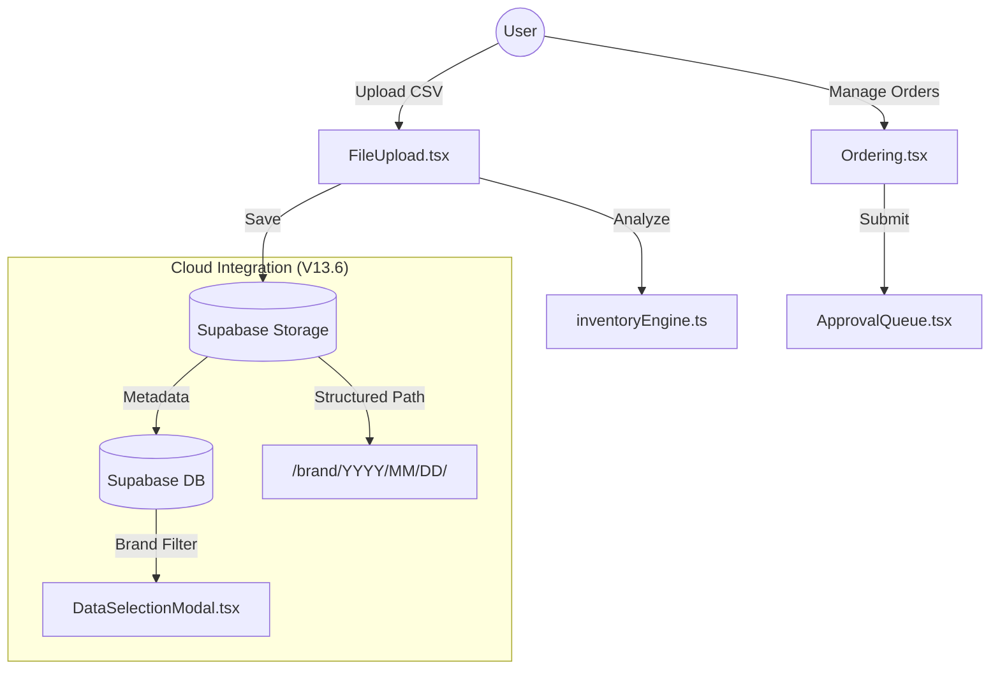

# ATP Supply Chain Analytics - V14 Overview

This document provides a technical summary of **V14 (including V13.6 fixes)**, focusing on the inventory engine, cloud integration, and brand-specific workflows.

> [!abstract] Core Objective
> To provide a high-performance, real-time decision support system for Auto Parts (ATP) supply chain management, supporting multiple brands (Kia, Mazda, Stellantis, BMW, MINI) with localized logic.

## 🏗️ Technical Architecture

## 📦 Key Modules

- **[[Inventory Engine]]**: Core calculation logic for Net Reserve, MOS, and Ordering Quantities.
- **[[Cloud Snapshots]]**: Brand-aware storage and retrieval system using Supabase.
- **[[Approval Workflow]]**: Multi-level decision support for order validation.
- **[[Vibrant Premium UI]]**: Modern Glassmorphism aesthetic with Bento-Grid layouts.

## 🛠️ Recent Improvements (V13.6)

> [!tip] Brand Synchronization
> We've implemented a universal `normalizeBrand` utility to ensure "KIA" in files matches "Kia" in user profiles.

- [x] **Universal Normalization**: Standardized brand names across all modules.
- [x] **Structured Storage**: Snapshots are now grouped by brand in folders (e.g., `inventory_snapshots/kia/...`).
- [x] **Filter Reliability**: Fixed "ID not found" errors for brand-specific accounts.
- [x] **Approval Tagging**: Requests now correctly carry the user's normalized brand metadata.
- [x] **SAA Engine (Phase 5)**: Unified Seasonal-Adaptive Anchor formula implemented.
- [x] **RLS Stability**: Permanent SQL fix for Supabase Storage policies.
- [x] **Seasonality Filter**: Added "Mùa vụ" button to smart filtering UI.

## 🔗 Internal References

- [[backup_history.md|View Full Backup Logs]]
- [[SAA_Engine_and_Seasonality.md|Phase 5: SAA Engine & Seasonality]]
- [[utils/supabase.ts|Supabase Utility Core]]
- [[utils/inventoryEngine.ts|Inventory Algorithm]]

---
%% Last updated by Antigravity AI on 2026-04-01 %%
